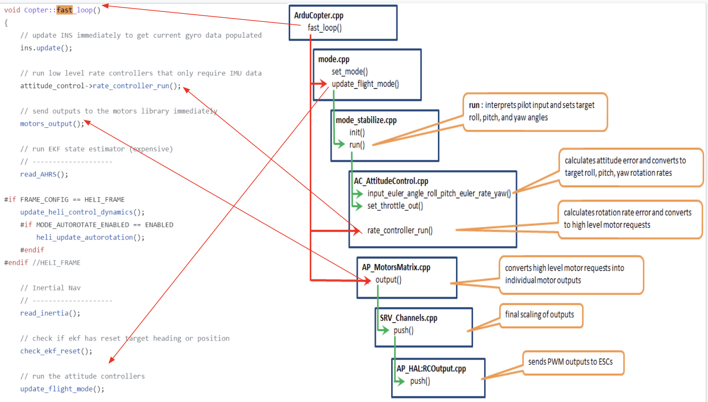
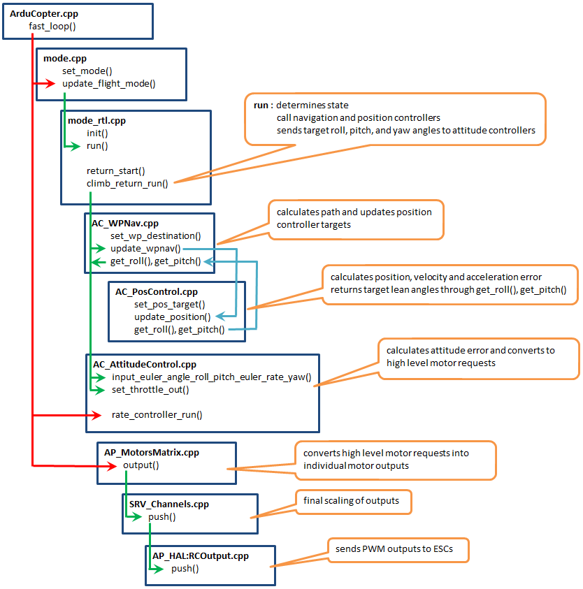

# Overview Logic

## An higher architecture of ArduCopter:

What this really mean is that,there is a Main loop that take control of the simulation of the copter vehicle for the entire copter program. Which is take control by the file [Copter.cpp](https://github.com/xpan11/Arducopter/blob/master/ArduCopter/Copter.cpp) Then the Main loop with run different flight mode base on the desire of user, subsequently different mode will run the [Position control](https://github.com/xpan11/Arducopter/blob/master/libraries/AC_AttitudeControl/AC_PosControl.cpp) and [Attitute control](https://github.com/xpan11/Arducopter/blob/master/libraries/AC_AttitudeControl/AC_AttitudeControl.cpp) differently to modify those important parameter(Throttle, Yaw, Pithch, Roll). However the method to modify those paramter is to set the differences of the motors of the copter, thus it then will run the motor program. Once all these done, it will output final parameter to the hardware and then perform what we see in the screen.

## 

Sums up: 

- [Main loop(Copter.cpp)](https://github.com/xpan11/Arducopter/blob/master/ArduCopter/Copter.cpp)
- -> Mode program([example: GUIDED](https://github.com/xpan11/Arducopter/blob/master/ArduCopter/mode_guided.cpp)) 
- -> [Position control](https://github.com/xpan11/Arducopter/blob/master/libraries/AC_AttitudeControl/AC_PosControl.cpp) and [Attitute control](https://github.com/xpan11/Arducopter/blob/master/libraries/AC_AttitudeControl/AC_AttitudeControl.cpp) 
- -> Motors class 
- -> Output to hardware.

# Main loop:Copter.cpp

## fast_loop

Ardupilot data update by this fast loop in frquency of 400hz, in the ardupilot offical site, this picture shows what did Ardupilot do in each loop, we can compare it with the code:

First will run the mode program to apply position and attitude controller with PID and underlying mode program logic to set the important parameters(Yaw, Roll, Pitch, Throttle), and the loop will run the attitude controller directly  and produce the final data of those parameters. Once those parameters finish calcuated, it will be pass to motor class by the "Motors_output", and start to calculate data(such as, PWM, trust and other data) for each motor(Four motors in our case, defualt Quadcopter). Once the data of motors finish calculated, it will be pass to the Output channel to the hardware and perform movement.

## Other Function we may need to mind

`SCHED_TASK`

Because there are some other function need to be called in the loop but the frequency and process time is different, thus the SCHED_TASK function will set frqeuncy and process time for each fucntion need to be run and pass those information to the AP_Scheduler libary them arrange then to CPU for later running.

`Frequency Loop`

In the Copter.cpp, there are loop of different frenquency that used to perform tasks such as logging. For example, three_hz_loop is for part of the security check:

However, we can take advantage of some of these loop to satisfy our needs, for example, I use 10_hz_loop for data recording. Which will be discuss later.

# Mode program

In mode program, we will mainly talk about Stablize.cpp and Guided.cpp, which are two types of mode, one pass user input as data and perform action. The order one use inside controller to calculate parameters to achieve command.

Stablize.cpp(User input as parameter):

Guided.cpp(parameter calculate by waypoint controller):

## Stablize.cpp

First, the program is going to recieve user input by using `update_simple_mode()`. 

However, because the user input is raw data and need to forward process to produce the data that can be accept by the attitute controller. Thus, the `get_pilot_desired_lean_angles` function is going to calculate `roll and pitch` raw data into angles for later process. And then, the `get_pilot_desired_yaw_rate` is going to deal with the yaw input. 

The second part is safe check and change the `spool_state` base on motors status, which is the if loop with `if(!motors->armed())`.

here are explanation of spool_state:

The third part is to set parameters for attitude controller for some special cases, which is the switch part `switch(motors->get_spool_state())`.

The last step, is to pass yaw, pitch, roll, and throttle to attitude controller, and done the job for mode program, which is `attitude_control->inputt_euler_angle` and `attitude_control->set_throttle_out`.

