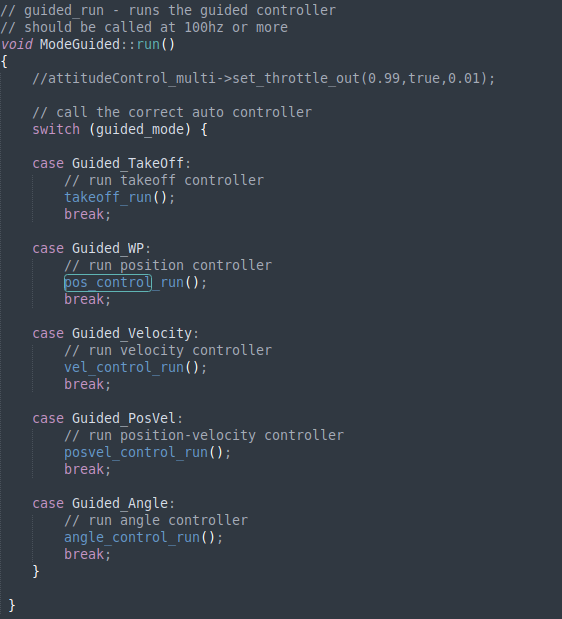
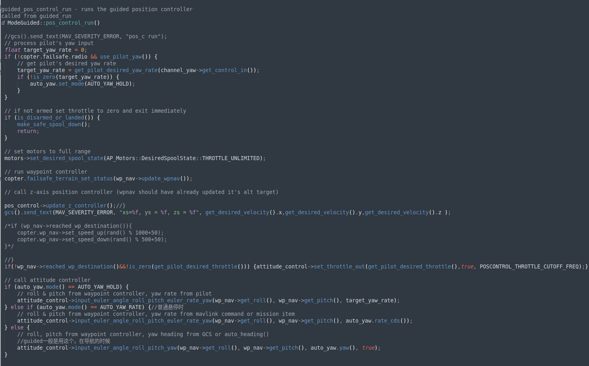

# Overview Logic

## An higher architecture of ArduCopter:

What this really mean is that,there is a Main loop that take control of the simulation of the copter vehicle for the entire copter program. Which is take control by the file [Copter.cpp](https://github.com/xpan11/Arducopter/blob/master/ArduCopter/Copter.cpp) Then the Main loop with run different flight mode base on the desire of user, subsequently different mode will run the [Position control](https://github.com/xpan11/Arducopter/blob/master/libraries/AC_AttitudeControl/AC_PosControl.cpp) and [Attitute control](https://github.com/xpan11/Arducopter/blob/master/libraries/AC_AttitudeControl/AC_AttitudeControl.cpp) differently to modify those important parameter(Throttle, Yaw, Pithch, Roll). However the method to modify those paramter is to set the differences of the motors of the copter, thus it then will run the motor program. Once all these done, it will output final parameter to the hardware and then perform what we see in the screen.

## 

Sums up: 

- [Main loop(Copter.cpp)](https://github.com/xpan11/Arducopter/blob/master/ArduCopter/Copter.cpp)
- -> Mode program([example: GUIDED](https://github.com/xpan11/Arducopter/blob/master/ArduCopter/mode_guided.cpp)) 
- -> [Position control](https://github.com/xpan11/Arducopter/blob/master/libraries/AC_AttitudeControl/AC_PosControl.cpp) and [Attitute control](https://github.com/xpan11/Arducopter/blob/master/libraries/AC_AttitudeControl/AC_AttitudeControl.cpp) 
- -> Motors class 
- -> Output to hardware.

# Main loop:Copter.cpp

## fast_loop

Ardupilot data update by this fast loop in frquency of 400hz, in the ardupilot offical site, this picture shows what did Ardupilot do in each loop, we can compare it with the code:

First will run the mode program to apply position and attitude controller with PID and underlying mode program logic to set the important parameters(Yaw, Roll, Pitch, Throttle), and the loop will run the attitude controller directly  and produce the final data of those parameters. Once those parameters finish calcuated, it will be pass to motor class by the "Motors_output", and start to calculate data(such as, PWM, trust and other data) for each motor(Four motors in our case, defualt Quadcopter). Once the data of motors finish calculated, it will be pass to the Output channel to the hardware and perform movement.

## Other Function we may need to mind

`SCHED_TASK`

Because there are some other function need to be called in the loop but the frequency and process time is different, thus the SCHED_TASK function will set frqeuncy and process time for each fucntion need to be run and pass those information to the AP_Scheduler libary them arrange then to CPU for later running.

`Frequency Loop`

In the Copter.cpp, there are loop of different frenquency that used to perform tasks such as logging. For example, three_hz_loop is for part of the security check:

However, we can take advantage of some of these loop to satisfy our needs, for example, I use 10_hz_loop for data recording. Which will be discuss later.

# Mode program

In mode program, we will mainly talk about Stablize.cpp and Guided.cpp, which are two types of mode, one pass user input as data and perform action. The order one use inside controller to calculate parameters to achieve command.

Stablize.cpp(User input as parameter):

Guided.cpp(parameter calculate by waypoint controller):

## Stabilize.cpp

What Stabilize mode do is that, if there are user input in the rc channel, it will get the input and transfer them to parameters to the controller and perform action.

First, the program is going to recieve user input by using `update_simple_mode()`. 

However, because the user input is raw data and need to forward process to produce the data that can be accept by the attitute controller. Thus, the `get_pilot_desired_lean_angles` function is going to calculate `roll and pitch` raw data into angles for later process. And then, the `get_pilot_desired_yaw_rate` is going to deal with the yaw input. 

The second part is safe check and change the `spool_state` base on motors status, which is the if loop with `if(!motors->armed())`.

here are explanation of spool_state:

The third part is to set parameters for attitude controller for some special cases, which is the switch part `switch(motors->get_spool_state())`.

The last step, is to pass yaw, pitch, roll, and throttle to attitude controller, and done the job for mode program, which is `attitude_control->inputt_euler_angle` and `attitude_control->set_throttle_out`.

## Guided.cpp

What Guided mode do is that, when user target a position on the map, the mode program will called the waypoint controller and attitude controller to calculate parameters(yaw, pitch, roll, throttle) itself and fly to the destination.

The entire Guided.cpp are drive by the run function:

In the function, the Guided_Takeoff is the one that will be run when user first arm the throttle and use `takeoff` command, which will initial the copter for waypoint controller to take over later.

However, we do experiments to check which case and controller will be run during the waypoint movement, and we found that it is the function `pos_control_run`, so lets take a closer look to this function.

part 1:

The first part is to check is user want to set the yaw input or not. If yes, program will pass it to the auttitude controller later. Which is the first case in part 5.

part 2:

The second part is very impotant, what the program do is that. It first run the waypoint controller, which will run underlying PID algorithm to make the first update of parameters like Yaw, Pitch, Roll. Then it will run the z_controller which will update calculate difference bettween currnt z(height) value to the desired z value, and set the trottle based on the calculation. After done runing waypoint controller and z__controller, Yaw, Pitch, Roll, Throttle are all ready to be passed to the attitude controller.

part 3:

This is one function we implemented: In order to fullfilled the data recording, we need to let the copter fly with radom throttle value to show the randomness. 

Because directly change throttle may mess up the PID calculation and subsequently mess up the controller. First I will make a list of different destinations randomly(0m <heights< 200m), then this line of code will make a speed up or speed down each time the copter reach one destination of the list. The speed_up and speed_down function will make the PID algorithm calculate the throttle differently, and thus allows the randomness of throttle.

part 4:

Oringnally, GUIDED mode did not allows user to input throttle while the just like we can do in the Stablize mode. So this line of code will check if there are user input throttle or not, if yes, take user input throttle as the throttle parameter and then pass it to next level controller.

part 5:

the last part of the position controller is to pass parameters to the attitude controller by using the function `attitude_control-> input_euler_angle_roll_pith_yaw` for later process. Which we will discuss later how those value will be process and pass to the motors class.

# Attitude Controller

For the Attitude controller, I think it is easier to follow the proccess we just saw in the Guided_mode program, so we can first take a close look to the function `input_euler_angle_roll_pith_yaw`.

Part 1:

First, the parameters(Roll, Pitch, Yaw) just passed in by the Guided mode program will be calculate to angle for later used in this program. those `set_angle` function just for data recording which we will discuss later. Then the program will also run `_attitude_target_quat` to get target parameters ready for later calculation with `euler_x_angle` parameter.

In this loop, the program just do calculation to make sure three 3-dimention-vectors-paramter(target euler angle, target euler rate, target angular velocity) is ready to 

convert euler angle derivative of derivative of desired attitude into a body-frame angular velocity vector for feed forward.

and set the limit to the angular velocity form, then

convert body-frame angular velocity back into euler angle derivative of desired attitue for later quat controller process.

After parameters in this program all been process and ready for next progress, call the quaternion attitue controller. 

